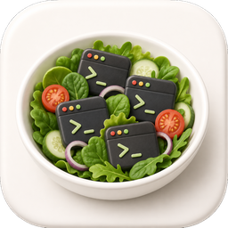
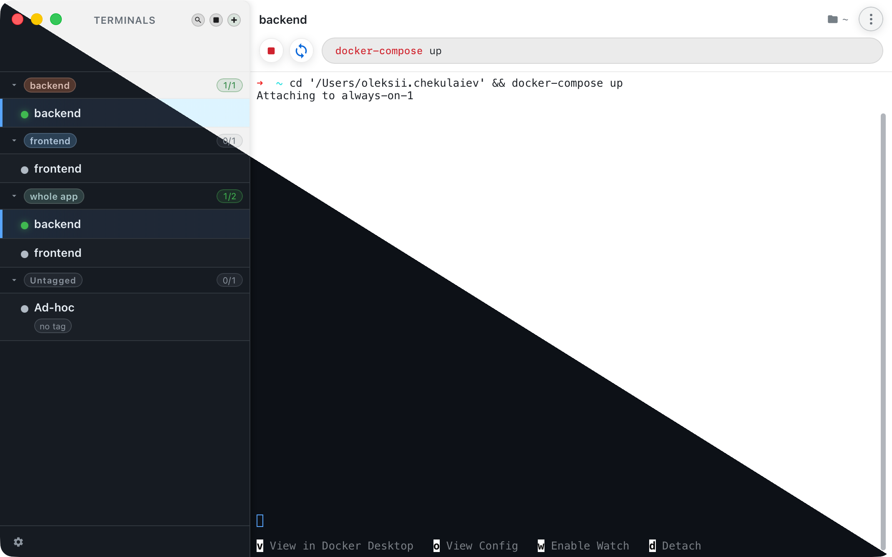

<p align="center">
  
</p>

# Lowcal Terminal Orchestrator

A small desktop app for keeping a tidy stable of dev terminals — one tab per
project / service, each backed by a real interactive PTY, each remembering its
own working directory, environment, command, and tags. Group profiles by **tag folders**.
Start / Stop whole tags at once.

Built with [Tauri 2](https://v2.tauri.app/) (Rust) + React + TypeScript +
[xterm.js](https://xtermjs.org/), so the bundle is a small native `.app` rather
than an Electron-sized download. macOS is the primary target today (hidden
titlebar + traffic-light overlay tuned for the sidebar header), but the Tauri
shell and the PTY layer (`portable-pty`) are cross-platform; Windows / Linux
builds should work and just won't get the macOS-specific chrome polish.

<p align="center">
  
</p>

---

## Why

A normal terminal multiplexer (tmux, iTerm tabs, VS Code's terminal) is
fine for one project. As soon as a workday means *"start the API, start the
worker, start the web dev server, tail this log, attach to that container,
keep a free shell for ad-hoc"*, the friction adds up:

- You retype (or up-arrow-fish) the same `cd … && npm run dev` for each tab.
- You can't tell at a glance which sessions are actually up.
- "Stop everything for this project" means clicking through eight tabs.
- A wedged foreground job (Docker Compose, a hung dev server) needs a manual
  Ctrl+C.
- When something exits with a non-zero code in the background, you don't
  notice until you switch back to its tab.

Lowcal Terminal Orchestrator makes each of those things a button:

- The command, cwd, env and tags live in a YAML file the app owns.
- A coloured status dot per tab — green for running, gray for stopped,
  **red** when a Start-injected command exited non-zero (with the exit code
  surfaced on hover).
- Tags in the sidebar let you group, and bulk-start/stop projects.

---

## Tech stack

| Layer | Tech |
|------|------|
| Shell / packaging | [Tauri 2](https://v2.tauri.app/) (Rust) |
| Frontend | React 18 + TypeScript + [Vite](https://vitejs.dev/) |
| Terminal renderer | [xterm.js](https://xtermjs.org/) + `@xterm/addon-fit` |
| PTY | [`portable-pty`](https://crates.io/crates/portable-pty) |
| PTY ↔ frontend bridge | [`axum`](https://crates.io/crates/axum) WebSocket on `127.0.0.1:<dynamic>` |
| Config | YAML via `serde_yaml`, watched with [`notify`](https://crates.io/crates/notify) |
| Native dialogs | [`tauri-plugin-dialog`](https://crates.io/crates/tauri-plugin-dialog) |

---

## Requirements

- **macOS** (primary), or Linux / Windows for unsupported-but-likely-works
  builds.
- **Node.js** 18+ and **npm**.
- **Rust** toolchain (stable). Install via [rustup](https://rustup.rs/).
- **Tauri 2 prerequisites** for your OS — see
  [Tauri's prerequisites guide](https://v2.tauri.app/start/prerequisites/).
  On macOS that's Xcode Command Line Tools (`xcode-select --install`).

---

## Getting started (dev)

```bash
git clone https://github.com/achekulaev/lowcal.git
cd lowcal
npm install
npm run tauri dev
```

The Tauri dev command starts Vite on `http://localhost:1420`, builds the Rust
side, and launches the desktop window with hot reload for the frontend.

On first launch, Lowcal copies [`terminals.example.yaml`](terminals.example.yaml)
into the OS app config directory as `terminals.yaml`. Edit it from inside the
app (right-click a profile → **Edit**, or **+** for a new one) or directly on
disk — external saves are watched and prompt to reload.

---

## Build a release `.app`

```bash
npm run tauri build
```

This runs the frontend build (`tsc && vite build`) and produces:

- `src-tauri/target/release/bundle/macos/LowCal.app`
- `src-tauri/target/release/bundle/dmg/LowCal_<version>_<arch>.dmg`

Tauri usually opens the DMG window after a successful build so you can drag
the app into `/Applications` yourself.

---

## Configuration

`terminals.yaml` lives in the OS app config directory (e.g. on macOS:
`~/Library/Application Support/dev.lowcal.terminal-orchestrator/terminals.yaml`).

---

## Keyboard shortcuts

| Shortcut | Action |
|------|------|
| `Cmd+T` / `Ctrl+T` | Open **New terminal** (create profile). |
| `Cmd+=` / `Ctrl+=` | Same as **New terminal**. |
| `Cmd+F` / `Ctrl+F` | Focus sidebar profile filter (flat-results mode). |
| `Esc` | In the filter: clear and close. In the editor modal: cancel. |
| `Cmd+Enter` / `Ctrl+Enter` | In the editor modal: save. |

## Status

This is a personal-scratch project that I've been finding useful enough to
keep iterating on. The API and config schema may shift between minor
versions; the YAML config is forward-compatible (unknown fields are
preserved by the editor) but no formal migration guarantees yet.

Issues and PRs welcome, but expect slow turnaround.

---

## License

No license is published in this repository yet. Until one is added, the
default is **all rights reserved** — please open an issue if you'd like to
use it for anything beyond evaluation.
